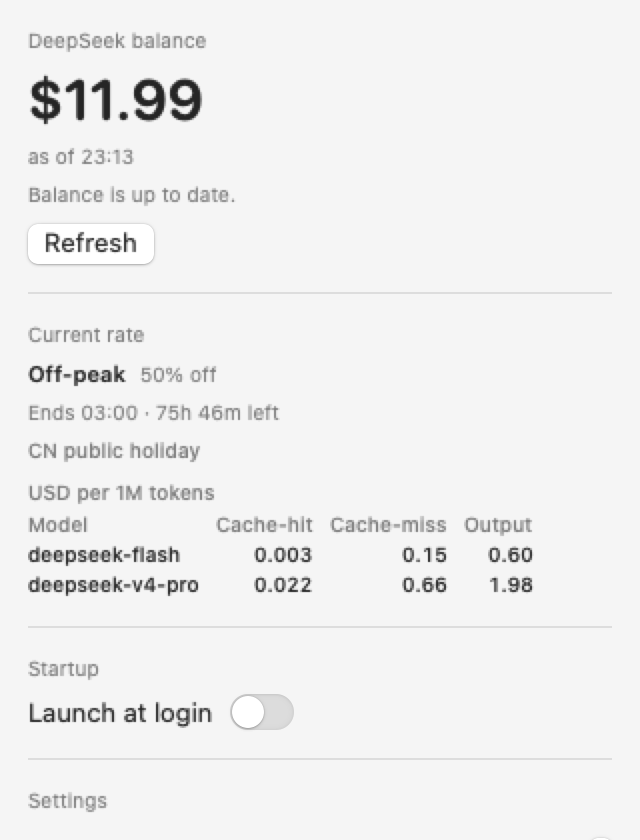
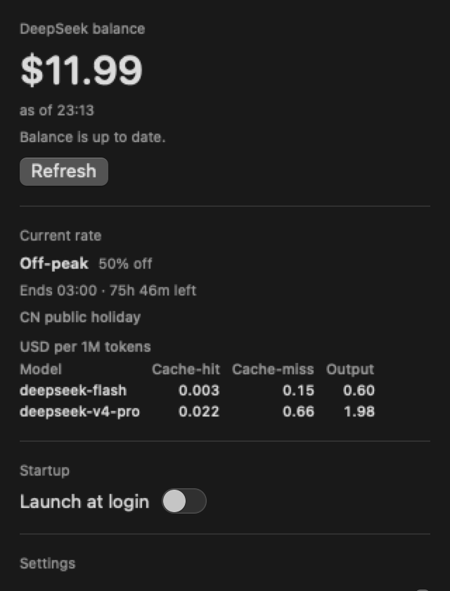
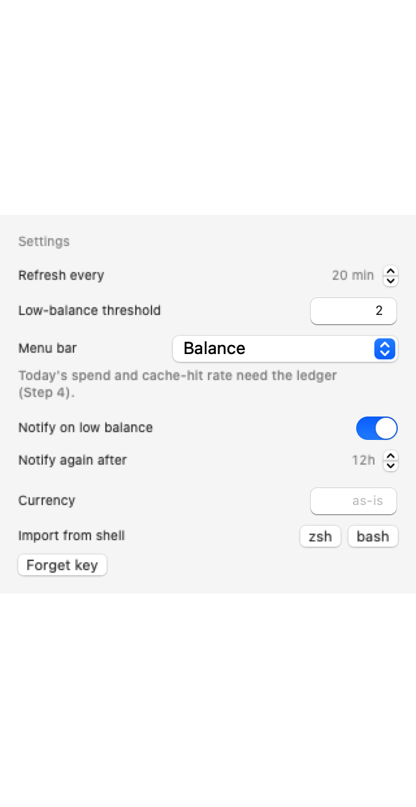

# DeepTally

[](https://github.com/genoma/deeptally/actions/workflows/ci.yml)

**DeepSeek usage meter for the macOS menu bar.** Balance, spend, tokens and cache-hit rate — at a glance, locally.

> **Status: pre-alpha.** Step 4 is done — the menu bar shows the live balance plus two ledger-backed metrics
> (today's spend and the cache-hit rate), the app imports local opencode usage into its own SQLite ledger,
> and the CLI can import, summarise, export, prune and reprice. The analytics popover and CSV import are
> Step 5 in [`docs/PLAN.md`](docs/PLAN.md).

## What it does

- Shows your DeepSeek account balance in the menu bar, with an explicit "as of" timestamp
- Switches the menu bar between **balance**, **today's spend** and the **cache-hit rate** (cache reads over
  prompt tokens for the trailing 30 local days)
- Keeps a **local usage ledger** — imported from opencode's database (read-only), each row priced with the
  peak / off-peak window that was in force at the row's own timestamp
- Tells you whether you are in a **peak or off-peak window right now** — in your local time — with a countdown
  to the next switch and the effective price for each model in that window, in the price table's own currency
- Alerts when the balance drops below a threshold you set — and while macOS will not deliver the alert, a
  warning glyph stands in for the menu bar gauge
- Starts at login, lives in the menu bar, no Dock icon
- Ships a small CLI (`deeptally usage`, `deeptally import`, `deeptally ledger …`, `deeptally balance`,
  `deeptally rate`, `deeptally key …`) for scripts and terminals

Spend is computed locally from real token counters and the versioned price table, so every ledger figure is an
**estimate** — DeepSeek has no historical usage API ([`docs/PLAN.md`](docs/PLAN.md) §3). The balance is not an
estimate: it comes straight from `GET /user/balance`.

How to connect your API key, what each popover section shows and every setting are documented in
[`docs/USAGE.md`](docs/USAGE.md).

## What it does not do

- No telemetry, no account, no cloud sync. Everything stays on your Mac.
- Never stores prompt or completion **content** — counters, timestamps and model names only
- Does not scrape DeepSeek's private dashboard endpoints (account balance only, today)
- Not affiliated with, endorsed by, or connected to DeepSeek

## Install

Ad-hoc signed, not notarized — [`docs/UNSIGNED.md`](docs/UNSIGNED.md) explains what macOS is warning about.
No release is published yet: these commands start resolving with the first one (v0.1.0).

**Install script** (recommended; verifies the DMG's SHA-256 and never triggers the Gatekeeper dialog):

```sh
curl -fsSL https://github.com/genoma/deeptally/releases/latest/download/install.sh | bash -s -- --user
```

**DMG** — download `DeepTally-<version>.dmg` from the
[releases page](https://github.com/genoma/deeptally/releases), drag `DeepTally.app` into `/Applications`,
then follow the first-launch steps in [`docs/INSTALL.md`](docs/INSTALL.md).

**CLI only** — download `deeptally-X.Y.Z-arm64.tar.gz` from the releases page and keep the `deeptally`
binary and `DeepTally_DeepTallyCore.bundle` from the archive together in a directory on your `PATH`.
[`docs/INSTALL.md`](docs/INSTALL.md) has the commands.

**Uninstall** — the popover's **Uninstall DeepTally…** button offers **Export CSV First…**, then removes the
login item, the Keychain item, the ledger, preferences, caches and saved state, and moves the app to the
Trash. [`docs/INSTALL.md`](docs/INSTALL.md#uninstalling) describes each step and the `Scripts/uninstall.sh`
route for source builds.

## CLI

```sh
deeptally balance                        # account balance
deeptally rate                           # peak/off-peak window now, with prices
deeptally usage [--json] [--days N]      # today, last 7 and last 30 days, then per model
deeptally import [--full]                # import local opencode usage into the ledger
deeptally ledger export <path.csv>       # write every raw ledger row as CSV
deeptally ledger prune --days N          # delete raw rows older than N days (rollups kept)
deeptally ledger reprice [--json]        # recompute stored costs with the current price table
deeptally key status                     # which store supplies the key, and any Keychain problem
deeptally key import [--shell zsh|bash]  # import the key from the login shell into the Keychain
deeptally key delete                     # forget the stored key
deeptally --version | --help
```

Like the app, the CLI reads the API key from the **Keychain first, then `DEEPSEEK_API_KEY`**, so a terminal
and the menu bar use the same key. Exit codes are contractual: `0` ok, `2` the key path failed (no key, or the
balance request itself), `1` a usage error or any other failure. `deeptally key status` exits `0` whenever it
can name a key — including a Keychain read that failed while `DEEPSEEK_API_KEY` supplied one — and `2` only
when there is no key at all. Full command reference: [`docs/USAGE.md`](docs/USAGE.md).

## Screenshots

Rendered from the shipping views by `make screenshots`, not drawn by hand:





## Development

Requires macOS 15+, Xcode Command Line Tools, Swift 6.4+. Xcode itself is not required.

```sh
make build     # build app + CLI
make test      # run tests
make bundle    # assemble DeepTally.app (ad-hoc signed)
make run       # launch the bundled app
```

`AGENTS.md` documents the toolchain, environment and conventions in detail.

### Quitting

DeepTally is an accessory app (`LSUIElement`): it has no Dock icon, nothing in the app switcher and no menu
bar of its own. To stop it:

- **Quit** in the popover footer, or ⌘Q while the popover is open, or
- `make kill` (equivalent to `pkill -f 'DeepTally.app/Contents/MacOS/DeepTally'`).

If the app is running but its status item is hidden, `make kill` is the reliable way out.

## Privacy

DeepTally talks to exactly one host today: `api.deepseek.com`, for your account balance. Usage history is
built locally from opencode's database (read-only) into a SQLite ledger at
`~/Library/Application Support/DeepTally/ledger.sqlite`; a loopback-only proxy that forwards your own requests
is planned for v1.1, opt-in. `api.github.com` is reserved for a future update check and is not contacted by
any current build. No analytics. No crash reporting. No third-party servers. The API key lives in the macOS
Keychain, never in a file or a preference; if the Keychain read fails, the app falls back to
`DEEPSEEK_API_KEY` and says so in a banner. What the ledger stores, and how to delete it, is in
[`docs/PRIVACY.md`](docs/PRIVACY.md).

## License

GPL-3.0-or-later. See [`LICENSE`](LICENSE).
